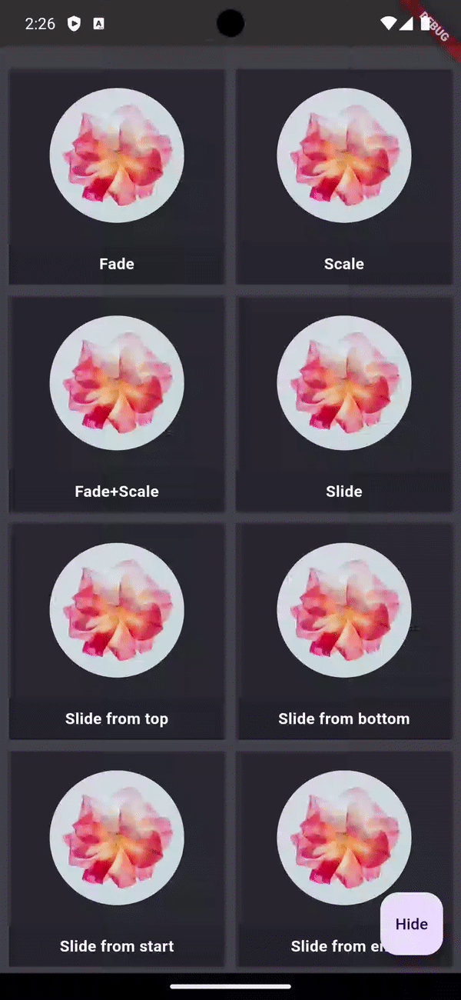
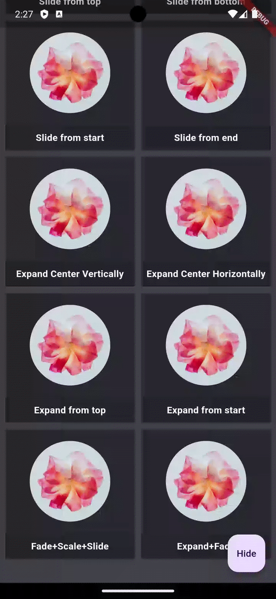

# d3_wallet

A Digital Wallet project.

<details>
<summary><h2>Navigation Architecture</h2></summary>

This project uses **GetX** for state management and navigation with a custom nested navigation implementation that supports both global and tab-level navigation.

### Navigation Types

#### 1. Global Navigation (Root Navigator)
Global navigation replaces the entire screen and hides the bottom navigation bar. Use this for app-level flows like splash → login → home.

**Usage:**
```dart
// Navigate to a new screen (pushes on stack)
Get.toNamed(Routes.LOGIN);

// Replace current screen (removes from stack)
Get.offNamed(Routes.LOGIN);

// Clear all screens and navigate
Get.offAllNamed(Routes.LOGIN);
```

**Example:**
```dart
// From Profile screen, navigate to Login globally
void _navigateToLogin() {
  Get.toNamed(Routes.LOGIN); // Hides bottom nav bar
}
```

#### 2. Nested Navigation (Tab Navigator)
Nested navigation keeps you within a specific tab and maintains the bottom navigation bar visibility. Each tab has its own navigation stack.

**Usage:**
```dart
// Navigate within a specific tab
Get.toNamed('/profile/details', id: NavIds.profile);

// Go back within a tab
Get.back(id: NavIds.profile);
```

**Example:**
```dart
// From Profile screen, navigate to Profile Detail (nested)
void _navigateToProfileDetail() {
  Get.toNamed(Routes.PROFILE_DETAIL, id: NavIds.profile);
}
```

### Navigator IDs

Navigator IDs are defined in `lib/app/modules/home/constants/nav_ids.dart`:

```dart
class NavIds {
  // Tab-level nested navigator IDs
  static const int wallet = 0;
  static const int transactions = 1;
  static const int qr = 2;
  static const int trends = 3;
  static const int profile = 4;
}
```

### Navigation Structure

```
Root Navigator (Global)
├── Splash Screen
├── Login Screen
└── Home Screen
    └── Bottom Navigation Bar
        ├── Wallet Tab (NavIds.wallet)
        │   └── Wallet Navigator
        │       └── Wallet screens...
        ├── Transactions Tab (NavIds.transactions)
        │   └── Transactions Navigator
        │       └── Transaction screens...
        ├── QR Tab (NavIds.qr)
        │   └── QR Navigator
        │       └── QR screens...
        ├── Trends Tab (NavIds.trends)
        │   └── Trends Navigator
        │       └── Trends screens...
        └── Profile Tab (NavIds.profile)
            └── Profile Navigator
                ├── Profile Screen (root)
                └── Profile Detail Screen
```

### Back Button Behavior

The app implements a smart back button handling system with the following priority:

1. **Global screens** (e.g., Login) → Pop back to previous screen
2. **Nested screens** (e.g., Profile Detail) → Pop back within tab
3. **Tab root screens** → Show "Press back again to exit" toast
4. **Second back press** (within 2 seconds) → Exit app

**Implementation:**
- `HomeController._onBackPressed()` handles back button logic
- `PopScope` wrappers in nav widgets handle tab-level back presses
- `BackButtonInterceptor` intercepts system back button events

### Adding New Nested Routes

To add a new nested route within a tab:

1. **Define the route** in `app_routes.dart`:
```dart
static const PROFILE_SETTINGS = _Paths.PROFILE + _Paths.PROFILE_SETTINGS;
```

2. **Add route to the nav widget** (e.g., `profile_nav.dart`):
```dart
if (settings.name == Routes.PROFILE_SETTINGS) {
  return GetPageRoute(
    settings: settings,
    page: () => ProfileSettingsView(),
    binding: ProfileSettingsBinding(),
  );
}
```

3. **Navigate using the navigator ID**:
```dart
Get.toNamed(Routes.PROFILE_SETTINGS, id: NavIds.profile);
```

### Key Files

- **`lib/app/modules/home/constants/nav_ids.dart`** - Navigator ID definitions
- **`lib/app/modules/home/controllers/home_controller.dart`** - Back button handling logic
- **`lib/app/modules/home/navs/`** - Tab navigator widgets (one per tab)
- **`lib/app/modules/home/views/home_view.dart`** - Home screen with bottom navigation
- **`lib/app/routes/app_routes.dart`** - Route name definitions
- **`lib/app/routes/app_pages.dart`** - Route configuration

### Best Practices

1. **Use global navigation** for screens that should replace the entire view (login, splash, etc.)
2. **Use nested navigation** for screens within a tab that should keep the bottom nav visible
3. **Always specify the `id` parameter** when navigating within a tab
4. **Use `Get.back(id: navId)`** to go back within a specific tab
5. **Use `Get.back()`** (without id) to go back on the global navigator

</details>

<details>
<summary><h2>Animated Visibility</h2></summary>

Animate appearance and disappearance using pre-built effects with the AnimatedVisibility widget.

 

</details>
