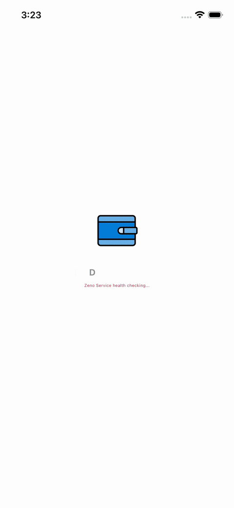

# d3_wallet

A Digital Wallet project.

## Table of Contents

- [I. Development Environment Setup](#i-development-environment-setup)
- [II. Navigation Architecture](#ii-navigation-architecture)
  1. [Navigation Types](#1-navigation-types)
  2. [Navigator IDs](#2-navigator-ids)
  3. [Navigation Structure](#3-navigation-structure)
  4. [Back Button Behavior](#4-back-button-behavior)
  5. [Adding New Nested Routes](#5-adding-new-nested-routes)
  6. [Key Files](#6-key-files)
  7. [Robust Argument Retrieval](#7-robust-argument-retrieval)
  8. [Best Practices](#8-best-practices)
- [III. Demos](#iii-demos)
- [IV. References](#iv-references)

## I. Development Environment Setup

This guide explains how to set up your development environment for macOS on
Apple Silicon.

### 1. Installation Steps

Follow these steps in order to set up the core development tools:

1. **Install Homebrew**:
   If you haven't already, install [Homebrew](https://brew.sh/), the missing
   package manager for macOS:

   ```bash
   /bin/bash -c "$(curl -fsSL https://raw.githubusercontent.com/Homebrew/install/HEAD/install.sh)"
   ```

2. **Install FVM (Flutter Version Management)**:
   Use Homebrew to install [FVM](https://fvm.app/) to manage different Flutter
   SDK versions easily:

   ```bash
   brew tap leoafarias/fvm
   brew install fvm
   ```

3. **Install Flutter SDK via FVM**:
   Use FVM to install the latest stable Flutter SDK:

   ```bash
   fvm install 3.38.5
   fvm use 3.38.5 --global
   ```

4. **Environment Variables**:
   Add these to your `~/.zshrc` (or `~/.bashrc`) and run `source ~/.zshrc`:

   ```bash
   # Flutter & FVM
   export PATH="$HOME/fvm/versions/3.38.5/bin:$PATH"
   export FLUTTER_ROOT="$HOME/fvm/versions/3.38.5"

   # Dart Pub Cache
   export PATH="$PATH":"$HOME/.pub-cache/bin"

   # Android SDK
   export JAVA_HOME=$(/usr/libexec/java_home -v 17) # Adjust version if needed
   export ANDROID_HOME="$HOME/Library/Android/sdk"
   export PATH="$PATH:$ANDROID_HOME/cmdline-tools/latest/bin"
   export PATH="$PATH:$ANDROID_HOME/platform-tools"

   # rbenv (if using the automation script)
   export PATH="$HOME/.rbenv/bin:$PATH"
   eval "$(rbenv init -)"
   ```

5. **Activate Global Dart Packages**:
   Activate essential Dart packages used in this project:

   ```bash
   dart pub global activate melos
   dart pub global activate flutter_gen
   dart pub global activate get_cli
   dart pub global activate flutterfire_cli
   ```

### 2. Install Other Essential Tools

To build and run the application on Android and iOS, you need to set up the
following:

#### 2.1. Java Development Kit (JDK)

Install the JDK required for Android builds:

- **Recommended**: [Azul Zulu JDK](https://www.azul.com/downloads/?package=jdk#zulu)
  (ARM64 version).

- Alternatively, via Homebrew:

   ```bash
   brew install --cask zulu@17
   ```

#### 2.2. Android Studio

1. Download and install [Android Studio](https://developer.android.com/studio).
2. Open **Settings** > **Languages & Frameworks** > **Android SDK**.
3. Install the latest **SDK Platforms** and **SDK Tools** (including
   **Android SDK Command-line Tools**).
4. Configure the `ANDROID_HOME` environment variable (see above).

#### 2.3. Xcode

1. Install **Xcode** from the Mac App Store.
2. Open Xcode, go to **Settings** > **Locations**, and ensure the
   **Command Line Tools** are selected.
3. Run the following to agree to the license:

   ```bash
   sudo xcodebuild -license
   ```

4. Install **CocoaPods** for iOS dependency management:

   ```bash
   sudo gem install cocoapods
   ```

### 3. Automation Script

A script is provided to automate parts of the setup (Go, Ruby, Git settings,
and package activation):

```bash
chmod +x scripts/install_dev_tools.sh
./scripts/install_dev_tools.sh
```

## II. Navigation Architecture

This project uses **GetX** for state management and navigation with a custom
nested navigation implementation that supports both global and tab-level
navigation.

### 1. Navigation Types

#### 1.1. Global Navigation (Root Navigator)

Global navigation replaces the entire screen and hides the bottom navigation
bar. Use this for app-level flows like splash → login → home.

**Usage:**

```dart
// Navigate to a new screen (pushes on stack)
Get.toNamed(Routes.LOGIN);

// Replace current screen (removes from stack)
Get.offNamed(Routes.LOGIN);

// Clear all screens and navigate
Get.offAllNamed(Routes.LOGIN);
```

**Example:**

```dart
// From Profile screen, navigate to Login globally
void _navigateToLogin() {
  Get.toNamed(Routes.LOGIN); // Hides bottom nav bar
}
```

#### 1.2. Nested Navigation (Tab Navigator)

Nested navigation keeps you within a specific tab and maintains the bottom
navigation bar visibility. Each tab has its own navigation stack.

**Usage:**

```dart
// Navigate within a specific tab
Get.toNamed('/profile/details', id: NavIds.profile);

// Go back within a tab
Get.back(id: NavIds.profile);
```

**Example:**

```dart
// From Profile screen, navigate to Profile Detail (nested)
void _navigateToProfileDetail() {
  Get.toNamed(Routes.PROFILE_DETAIL, id: NavIds.profile);
}
```

### 2. Navigator IDs

Navigator IDs are defined in `lib/app/modules/home/constants/nav_ids.dart`:

```dart
class NavIds {
  // Tab-level nested navigator IDs
  static const int wallet = 0;
  static const int transactions = 1;
  static const int qr = 2;
  static const int trends = 3;
  static const int profile = 4;
}
```

### 3. Navigation Structure

```text
Root Navigator (Global)
├── Splash Screen
├── Login Screen
└── Home Screen
    └── Bottom Navigation Bar
        ├── Wallet Tab (NavIds.wallet)
        │   └── Wallet Navigator
        │       └── Wallet screens...
        ├── Transactions Tab (NavIds.transactions)
        │   └── Transactions Navigator
        │       └── Transaction screens...
        ├── QR Tab (NavIds.qr)
        │   └── QR Navigator
        │       └── QR screens...
        ├── Trends Tab (NavIds.trends)
        │   └── Trends Navigator
        │       └── Trends screens...
        └── Profile Tab (NavIds.profile)
            └── Profile Navigator
                ├── Profile Screen (root)
                └── Profile Detail Screen
```

### 4. Back Button Behavior

The app implements a smart back button handling system with the following
priority:

1. **Global screens** (e.g., Login) → Pop back to previous screen
2. **Nested screens** (e.g., Profile Detail) → Pop back within tab
3. **Tab root screens** → Show "Press back again to exit" toast
4. **Second back press** (within 2 seconds) → Exit app

**Implementation:**

- `HomeController._onBackPressed()` handles back button logic
- `PopScope` wrappers in nav widgets handle tab-level back presses
- `BackButtonInterceptor` intercepts system back button events

### 5. Adding New Nested Routes

To add a new nested route within a tab:

#### 5.1. Define the route in `app_routes.dart`

```dart
static const PROFILE_SETTINGS = _Paths.PROFILE + _Paths.PROFILE_SETTINGS;
```

#### 5.2. Add route to the nav widget (e.g., `profile_nav.dart`)

```dart
if (settings.name == Routes.PROFILE_SETTINGS) {
  return GetPageRoute(
    settings: settings,
    page: () => ProfileSettingsView(),
    binding: ProfileSettingsBinding(),
  );
}
```

#### 5.3. Navigate using the navigator ID

```dart
Get.toNamed(Routes.PROFILE_SETTINGS, id: NavIds.profile);
```

### 6. Key Files

- **`lib/app/modules/home/constants/nav_ids.dart`** - Navigator IDs
- **`lib/app/modules/home/controllers/home_controller.dart`**
  - Back button logic
- **`lib/app/modules/home/navs/`** - Tab navigator widgets (one per tab)
- **`lib/app/modules/home/views/home_view.dart`** - Home screen with bottom nav
- **`lib/app/routes/app_routes.dart`** - Route name definitions
- **`lib/app/routes/app_pages.dart`** - Route configuration

### 7. Robust Argument Retrieval

When using nested navigation, the global `Get.arguments` singleton may return
`null` because it primarily tracks the root navigator. To handle arguments
reliably across all navigator types, follow this standardized pattern:

#### 7.1. Pass Arguments via Binding (in the Nav widget)

In your tab's navigator widget (e.g., `trends_nav.dart`), pass
`settings.arguments` to the binding:

```dart
if (settings.name == Routes.DETAIL) {
  return GetPageRoute(
    settings: settings,
    page: () => DetailView(),
    binding: DetailBinding(arguments: settings.arguments), // Pass here
  );
}
```

#### 7.2. Receive in Binding and Inject to Controller

Update your `Binding` to accept the arguments and inject them into the
`Controller` constructor:

```dart
class DetailBinding extends Bindings {
  final Object? arguments;
  DetailBinding({this.arguments});

  @override
  void dependencies() {
    Get.lazyPut(() => DetailController(
      arguments: arguments,
    ));
  }
}
```

#### 7.3. Use Standardized Retrieval in Controller

Update your `Controller` to pass arguments to `super` and use
`retrieveArgument`:

```dart
class DetailController extends BaseController {
  DetailController({Object? arguments}) : super(constructorArgs: arguments);

  @override
  void onReady() {
    super.onReady();
    // Prioritizes constructorArgs, then falls back to global Get.arguments
    final data = retrieveArgument<MyDataType>(NavigationArguments.key);
  }
}
```

### 8. Best Practices

1. **Use global navigation** for screens that should replace the entire view
   (login, splash, etc.)
2. **Use nested navigation** for screens within a tab that should keep the
   bottom nav visible
3. **Always specify the `id` parameter** when navigating within a tab
4. **Use `Get.back(id: navId)`** to go back within a specific tab
5. **Use `Get.back()`** (without id) to go back on the global navigator
6. **Prefer Constructor Injection** (Section 7) for all nested routes to
   ensure arguments are never null.

## III. Demos

<table>
  <tr>
    <td align="center"><b>Splash & Onboard</b></td>
    <td align="center"><b>Wallet List</b></td>
    <td align="center"><b>Token Details</b></td>
  </tr>
  <tr>
    <td></td>
    <td></td>
    <td></td>
  </tr>
  <tr>
    <td></td>
    <td></td>
    <td></td>
  </tr>
</table>

## IV. References

### 1. UI/UX Design
-   [MetaMask Redesign on Figma](https://www.figma.com/design/uy4hISX1JFBu02QMpBKBql/Case-Study--Web-3.0---MetaMask-Redesign--Community-?m=auto&t=i8dTyUCu7EZFdKiT-6) - Web 3.0 wallet redesign case study used as design inspiration.

### 2. API Documents
-   [Swagger Docs](https://digital-wallet-93c4ba68a41d.herokuapp.com/api/v1/docs) - Interactive API documentation for backend endpoints.

## V. License

Copyright © 2025, one of DanhDue ExOICTIF projects. All rights reserved.

---

Built with ❤️ using GetX, Melos and more....